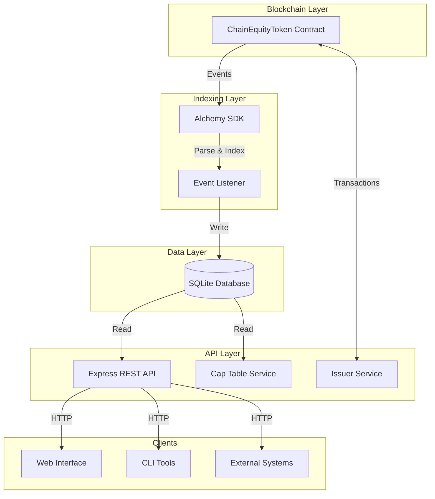
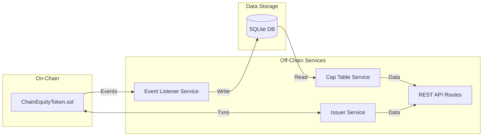
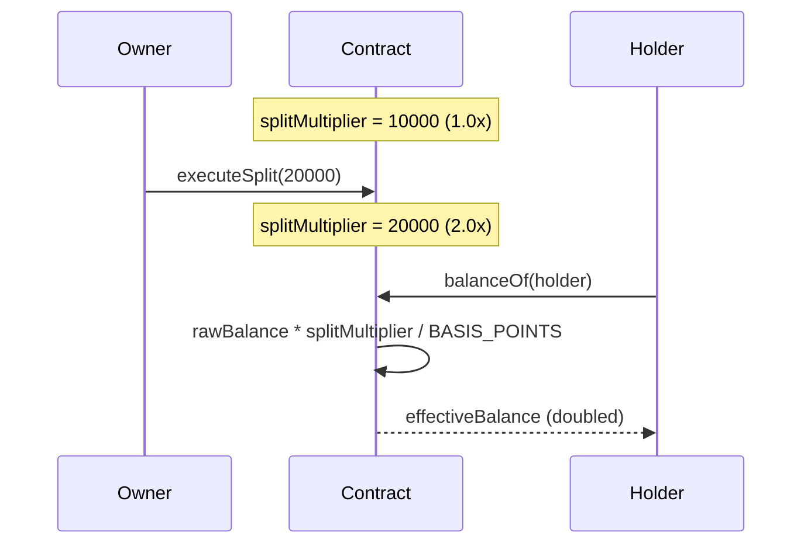
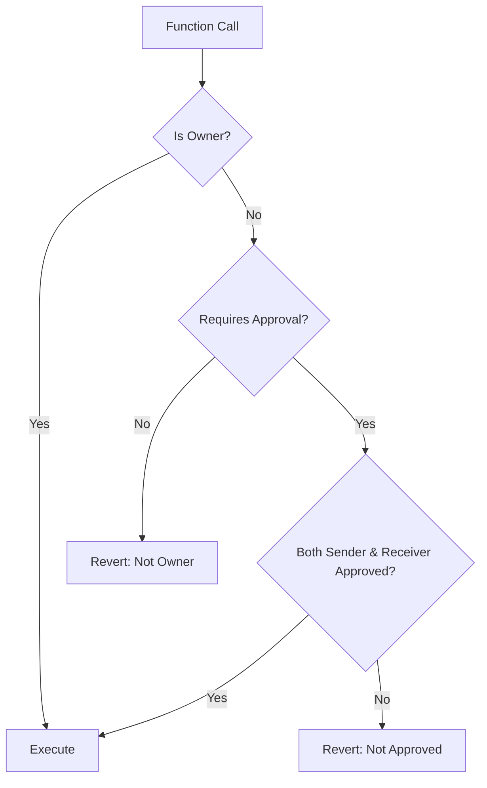
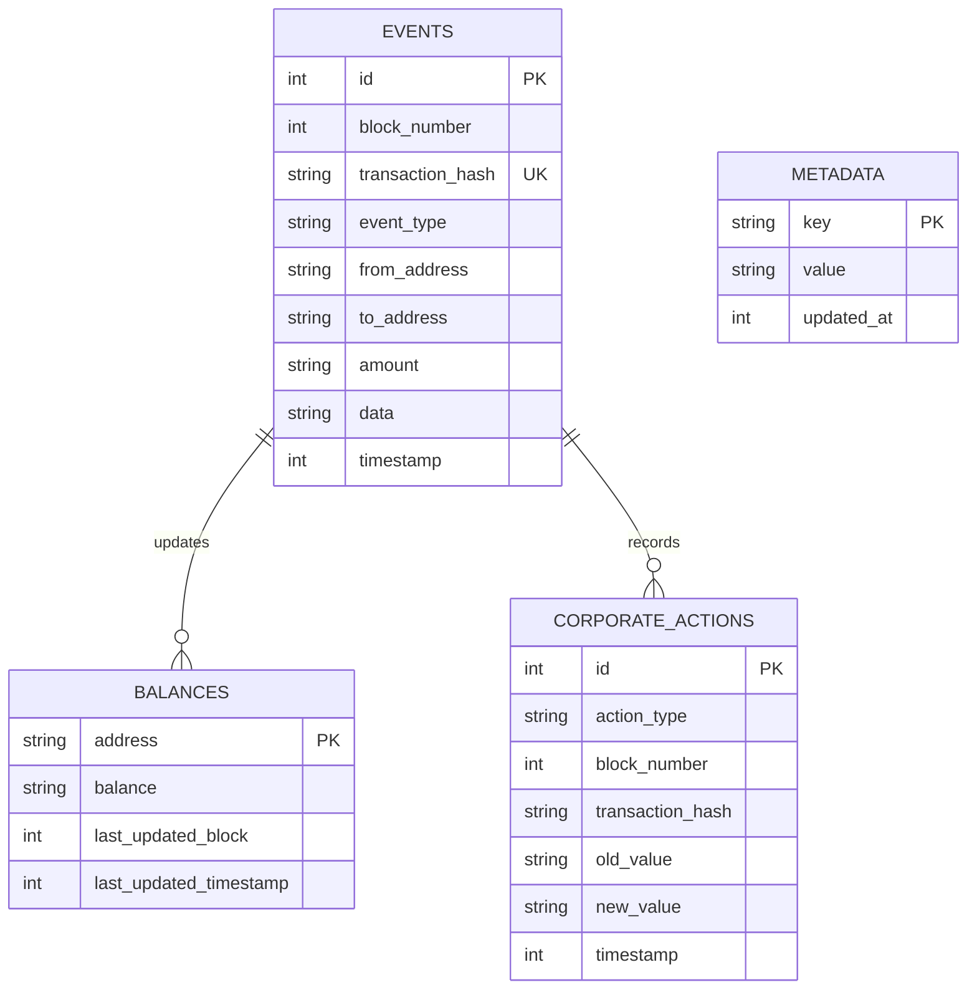
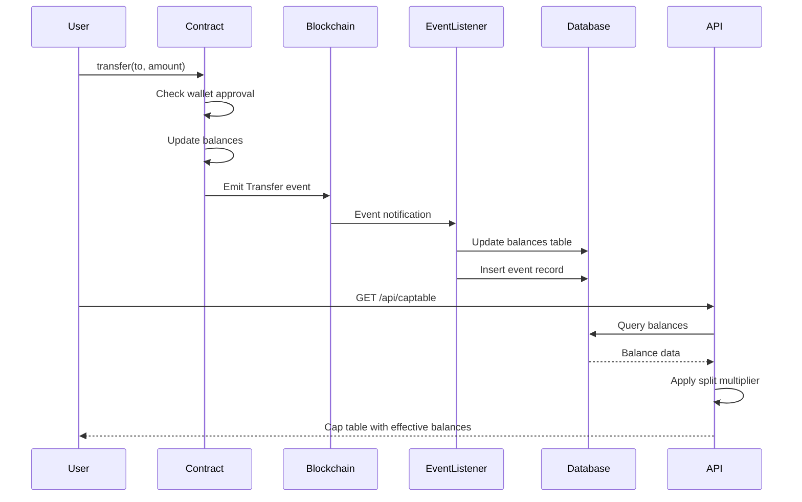
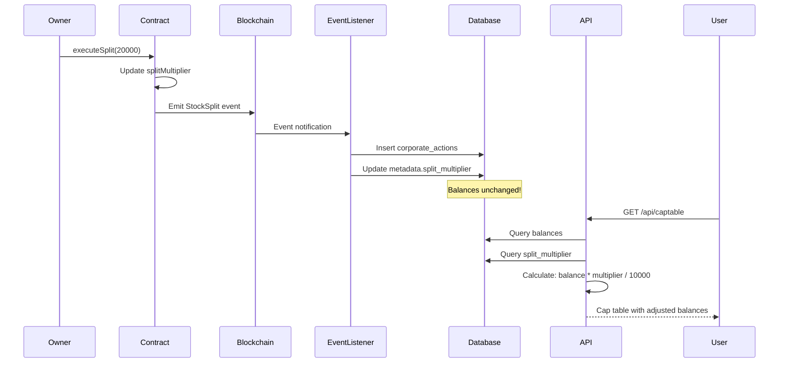
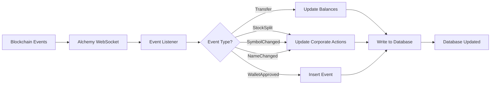
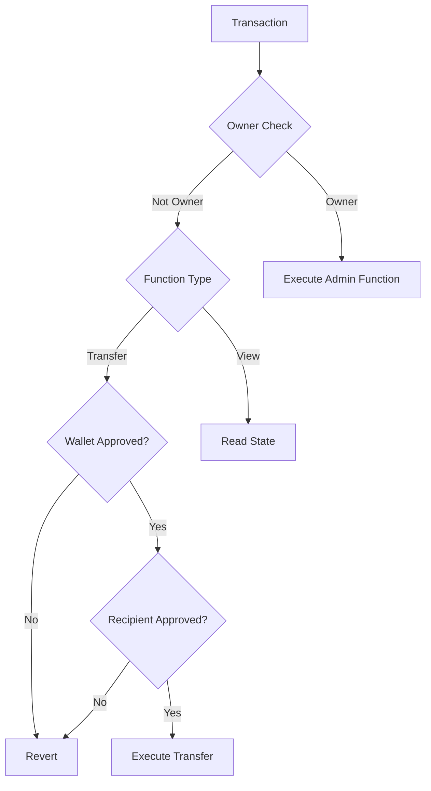

# ChainEquity Architecture

This document describes the technical architecture of the ChainEquity tokenized securities platform.

---

## Table of Contents

- [System Overview](#system-overview)
- [Component Architecture](#component-architecture)
- [Smart Contract Layer](#smart-contract-layer)
- [Backend Services](#backend-services)
- [Database Schema](#database-schema)
- [Data Flow](#data-flow)
- [Deployment Architecture](#deployment-architecture)
- [Security Architecture](#security-architecture)
- [Scalability Considerations](#scalability-considerations)

---

## System Overview

ChainEquity is a three-tier architecture consisting of:

1. **Smart Contract Layer** - On-chain token logic and state
2. **Event Indexing Layer** - Off-chain event processing and database writes
3. **API Layer** - REST API for querying cap table and analytics



---

## Component Architecture

### High-Level Components



### Component Responsibilities

| Component | Responsibility | Technology |
|-----------|---------------|------------|
| **ChainEquityToken** | Token logic, transfers, splits | Solidity 0.8.20 |
| **Event Listener** | Index blockchain events | Alchemy SDK, TypeScript |
| **Database Service** | Data persistence | SQLite, better-sqlite3 |
| **Cap Table Service** | Balance calculations, analytics | TypeScript |
| **Issuer Service** | Contract interactions | Viem, TypeScript |
| **API Routes** | HTTP endpoints | Express.js |

---

## Smart Contract Layer

### Contract Architecture

```solidity
ChainEquityToken (ERC-20)
├── Inheritance
│   ├── ERC20 (OpenZeppelin)
│   └── Ownable (OpenZeppelin)
├── State Variables
│   ├── mapping(address => bool) approvedWallets
│   ├── uint256 splitMultiplier
│   └── uint256 constant BASIS_POINTS = 10000
├── Core Functions
│   ├── mint(address, uint256)
│   ├── transfer(address, uint256)
│   ├── executeSplit(uint256)
│   ├── approveWallet(address)
│   ├── revokeWallet(address)
│   ├── updateSymbol(string)
│   └── updateName(string)
└── View Functions
    ├── balanceOf(address)
    ├── totalSupply()
    ├── getSplitMultiplier()
    └── isWalletApproved(address)
```

### Virtual Split Mechanism



**Key Benefits:**
- No iteration over holders
- Constant gas cost (~30k)
- Instant application to all balances
- Historical tracking via events

### Access Control



**Access Levels:**
- **Owner Only**: mint, executeSplit, approveWallet, revokeWallet, updateSymbol, updateName
- **Approved Wallets**: transfer, transferFrom
- **Anyone**: view functions (balanceOf, totalSupply, etc.)

---

## Backend Services

### Service Layer Architecture

```
backend/
├── src/
│   ├── api/                    # HTTP routes
│   │   ├── captable.routes.ts
│   │   ├── analytics.routes.ts
│   │   ├── corporate.routes.ts
│   │   └── issuer.routes.ts
│   ├── services/               # Business logic
│   │   ├── captable.service.ts
│   │   ├── eventListener.ts
│   │   └── issuer.service.ts
│   ├── db/                     # Data access
│   │   ├── database.ts
│   │   └── schema.sql
│   ├── middleware/             # Express middleware
│   │   ├── errorHandler.ts
│   │   └── rateLimiter.ts
│   ├── config/                 # Configuration
│   │   └── alchemy.config.ts
│   └── server.ts               # Express app
```

### Cap Table Service

Responsible for:
- Balance calculations with split multiplier
- Ownership distribution analysis
- Top holder queries
- Historical balance tracking
- CSV/JSON export

```typescript
class CapTableService {
  generateCapTable(): CapTable
  getTopHolders(limit: number): Holder[]
  getOwnershipDistribution(): Distribution
  getBalanceChanges(address: string): BalanceChange[]
  exportToCSV(capTable: CapTable): string
}
```

### Event Listener Service

Monitors blockchain for:
- Transfer events
- Mint events (Transfer from 0x0)
- WalletApproved events
- WalletRevoked events
- StockSplit events
- SymbolChanged events
- NameChanged events
- TransferBlocked events

```typescript
class EventListenerService {
  async start(): Promise<void>
  private async processTransferEvent(event: TransferEvent): Promise<void>
  private async processStockSplitEvent(event: StockSplitEvent): Promise<void>
  private async processWalletApprovedEvent(event: WalletApprovedEvent): Promise<void>
}
```

### Issuer Service

Contract interaction layer:
- Execute stock splits
- Mint tokens
- Approve/revoke wallets
- Update metadata
- Query contract state

```typescript
class IssuerService {
  async executeSplit(multiplierBasisPoints: number): Promise<TransactionReceipt>
  async mint(address: string, amount: bigint): Promise<TransactionReceipt>
  async approveWallet(address: string): Promise<TransactionReceipt>
  async getTokenInfo(): Promise<TokenInfo>
}
```

---

## Database Schema

### Entity Relationship Diagram



### Table Schemas

#### events
Stores all blockchain events for audit trail.

| Column | Type | Description |
|--------|------|-------------|
| id | INTEGER | Primary key |
| block_number | INTEGER | Block number |
| transaction_hash | TEXT | Unique transaction hash |
| event_type | TEXT | Event type (Transfer, WalletApproved, etc.) |
| from_address | TEXT | Sender address (for transfers) |
| to_address | TEXT | Receiver address (for transfers) |
| amount | TEXT | Amount (stored as string for big numbers) |
| data | TEXT | JSON data for additional fields |
| timestamp | INTEGER | Block timestamp |

#### balances
Current balance state for all addresses.

| Column | Type | Description |
|--------|------|-------------|
| address | TEXT | Primary key |
| balance | TEXT | Raw balance (before split multiplier) |
| last_updated_block | INTEGER | Last update block |
| last_updated_timestamp | INTEGER | Last update timestamp |

#### corporate_actions
Corporate actions history (splits, symbol/name changes).

| Column | Type | Description |
|--------|------|-------------|
| id | INTEGER | Primary key |
| action_type | TEXT | StockSplit, SymbolChange, NameChange |
| block_number | INTEGER | Block number |
| transaction_hash | TEXT | Transaction hash |
| old_value | TEXT | Previous value |
| new_value | TEXT | New value |
| timestamp | INTEGER | Block timestamp |

#### metadata
System metadata (split multiplier, sync state).

| Column | Type | Description |
|--------|------|-------------|
| key | TEXT | Primary key |
| value | TEXT | Value |
| updated_at | INTEGER | Last update timestamp |

---

## Data Flow

### Transfer Flow



### Stock Split Flow



### Event Processing Pipeline



---

## Deployment Architecture

### Local Development

```
┌─────────────────────────────────────┐
│  Developer Machine                  │
│                                     │
│  ┌──────────────────┐               │
│  │ Hardhat Node     │               │
│  │ (localhost:8545) │               │
│  └────────┬─────────┘               │
│           │                         │
│  ┌────────▼─────────┐               │
│  │ Backend Server   │               │
│  │ (localhost:3000) │               │
│  └────────┬─────────┘               │
│           │                         │
│  ┌────────▼─────────┐               │
│  │ SQLite Database  │               │
│  │ (./data/*.db)    │               │
│  └──────────────────┘               │
└─────────────────────────────────────┘
```

### Testnet Deployment

```
┌──────────────────────┐
│  Polygon Amoy        │
│  ChainEquityToken    │
│  0x123...            │
└──────────┬───────────┘
           │
           │ Events
           ↓
┌──────────────────────┐
│  Alchemy API         │
│  WebSocket Stream    │
└──────────┬───────────┘
           │
           ↓
┌──────────────────────┐
│  Backend Server      │
│  (Cloud VM/Container)│
│                      │
│  ┌────────────────┐  │
│  │ Event Listener │  │
│  │ Express API    │  │
│  │ SQLite DB      │  │
│  └────────────────┘  │
└──────────┬───────────┘
           │
           │ HTTPS
           ↓
┌──────────────────────┐
│  Clients             │
│  (Web, Mobile, CLI)  │
└──────────────────────┘
```

### Production Architecture

```
┌─────────────────────────────────────────────┐
│  Load Balancer (Nginx/ALB)                  │
└──────────────┬──────────────────────────────┘
               │
       ┌───────┴────────┐
       │                │
┌──────▼──────┐  ┌──────▼──────┐
│  API Server │  │  API Server │
│  Instance 1 │  │  Instance 2 │
└──────┬──────┘  └──────┬──────┘
       │                │
       └───────┬────────┘
               │
        ┌──────▼──────┐
        │  PostgreSQL │ (or managed DB)
        │  Primary    │
        └──────┬──────┘
               │
        ┌──────▼──────┐
        │  PostgreSQL │
        │  Replica    │
        └─────────────┘

┌─────────────────────────────────────────────┐
│  Event Indexer Service                      │
│  (Separate process/container)               │
│  Alchemy → Database writes                  │
└─────────────────────────────────────────────┘

┌─────────────────────────────────────────────┐
│  Ethereum Mainnet                           │
│  ChainEquityToken Contract                  │
└─────────────────────────────────────────────┘
```

---

## Security Architecture

### Smart Contract Security



**Security Measures:**
- **Access Control**: Owner-only functions for critical operations
- **Wallet Allowlist**: Prevents transfers to unapproved addresses
- **Integer Overflow Protection**: Solidity 0.8+ built-in
- **Reentrancy Protection**: Follow checks-effects-interactions pattern
- **Event Emission**: All state changes emit events for transparency

### Backend Security

**Authentication & Authorization:**
- API keys for sensitive endpoints (future)
- Rate limiting (100 requests per 15 minutes)
- Input validation on all endpoints

**Data Security:**
- SQLite with WAL mode for data integrity
- Read-only database connections for API queries
- Prepared statements to prevent SQL injection

**Network Security:**
- HTTPS enforcement in production
- CORS configuration
- Helmet.js security headers
- Request size limits

---

## Scalability Considerations

### Current Limitations

| Component | Limitation | Max Capacity |
|-----------|-----------|--------------|
| SQLite Database | Single-writer | ~1000 writes/sec |
| Event Listener | Sequential processing | Limited by block time |
| API Server | Single instance | ~1000 req/sec |

### Scaling Strategies

#### Horizontal Scaling

```
┌─────────────────┐
│  Load Balancer  │
└────────┬────────┘
         │
    ┌────┴────┐
    │         │
┌───▼──┐  ┌──▼───┐
│ API  │  │ API  │
│  #1  │  │  #2  │
└───┬──┘  └──┬───┘
    │         │
    └────┬────┘
         │
    ┌────▼────┐
    │PostgreSQL│
    └─────────┘
```

**Recommendations:**
1. **Replace SQLite with PostgreSQL** for multi-writer support
2. **Separate Event Indexer** from API server
3. **Read Replicas** for high-traffic read operations
4. **Caching Layer** (Redis) for frequently accessed data

#### Database Optimization

```sql
-- Partitioning by date
CREATE TABLE events_2024_01 PARTITION OF events
FOR VALUES FROM ('2024-01-01') TO ('2024-02-01');

-- Materialized views for analytics
CREATE MATERIALIZED VIEW holder_stats AS
SELECT address, balance, last_updated_block
FROM balances
WHERE CAST(balance AS REAL) > 0;
```

#### Caching Strategy

```
┌─────────┐     ┌─────────┐     ┌──────────┐
│  Client │────▶│  Redis  │────▶│PostgreSQL│
└─────────┘     └─────────┘     └──────────┘
                     │
                Cache Hit (90%)
                     │
                Direct Return
```

**Cacheable Data:**
- Cap table summaries (5 min TTL)
- Top holders list (5 min TTL)
- Analytics overviews (5 min TTL)
- Corporate action history (1 hour TTL)

---

## Future Architecture Enhancements

### Microservices Architecture

```
┌────────────────┐
│  API Gateway   │
└───────┬────────┘
        │
    ┌───┴────────────────────────┐
    │                            │
┌───▼──────────┐      ┌──────────▼───┐
│  Cap Table   │      │  Analytics   │
│  Service     │      │  Service     │
└───┬──────────┘      └──────────┬───┘
    │                            │
    └───────────┬────────────────┘
                │
         ┌──────▼──────┐
         │  Database   │
         └─────────────┘
```

### Event Sourcing Pattern

```
Events → Event Store → Projections → Read Models
                   ↓
              Event Bus
                   ↓
           Multiple Consumers
```

### GraphQL API

Replace REST with GraphQL for:
- Flexible querying
- Reduced over-fetching
- Real-time subscriptions
- Better developer experience

---

## Monitoring & Observability

### Metrics to Track

**Smart Contract:**
- Gas usage per operation
- Transaction success rate
- Event emission rate
- Failed transactions

**Backend:**
- API response times
- Request rates per endpoint
- Database query performance
- Event processing lag
- Error rates

**Infrastructure:**
- Server CPU/memory usage
- Database size and growth
- Network throughput
- Disk I/O

### Recommended Tools

- **Logging**: Winston, Pino
- **Metrics**: Prometheus
- **Dashboards**: Grafana
- **Alerts**: PagerDuty, Opsgenie
- **APM**: Datadog, New Relic

---

## Disaster Recovery

### Backup Strategy

```
┌──────────────┐
│  Primary DB  │
└──────┬───────┘
       │
       ├─► Hourly Snapshots (S3)
       ├─► Daily Backups (Cold Storage)
       └─► WAL Archiving (Continuous)
```

### Recovery Procedures

1. **Data Corruption**: Restore from last snapshot
2. **Smart Contract Bug**: Deploy new contract, migrate balances
3. **Event Indexer Failure**: Replay events from last checkpoint
4. **Database Loss**: Rebuild from blockchain events (slow but possible)

---

## Performance Benchmarks

### Smart Contract

| Operation | Gas Cost | Time |
|-----------|----------|------|
| Transfer | 39,041 | ~2 sec |
| Mint | 38,850-73,050 | ~2 sec |
| Stock Split | 30,246 | ~2 sec |

### API Performance

| Endpoint | Response Time | Throughput |
|----------|---------------|------------|
| GET /api/captable | 50-100ms | 500 req/sec |
| GET /api/analytics/overview | 20-50ms | 1000 req/sec |
| GET /api/corporate/history | 10-30ms | 1000 req/sec |

### Database Performance

| Query | Rows | Time |
|-------|------|------|
| SELECT all balances | 10,000 | 50ms |
| SELECT top 100 holders | 100 | 5ms |
| INSERT event | 1 | 2ms |

---

**Last Updated:** 2025-11-04
**Version:** 0.10.2
